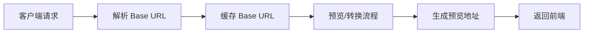

# 预览地址生成机制

## 一、 设计原则

预览地址始终以 ***客户端实际访问的域名与路径*** 为准。

系统在生成预览 URL 时，不使用后端服务自身的监听地址（如 `127.0.0.1:8184`），而是以用户浏览器真实访问的外部地址作为基础地址（Base URL），确保最终返回给前端的预览链接在各种部署环境下均可直接访问。

### 适用场景

该原则在以下场景尤为关键：

- ✅ 反向代理（Nginx / API Gateway）部署
- ✅ 子路径部署（如 `/previewer`）
- ✅ HTTPS 终止在网关层
- ✅ 多环境（开发 / 测试 / 生产）混合部署


## 二、 Base URL 的获取机制

系统会在收到预览请求时，从 HTTP 请求上下文及反向代理相关请求头中，动态解析出用户真实访问的 Base URL。

### 1. 域名与端口解析优先级

系统按以下顺序解析访问域名与端口（从高到低）：

| 优先级 | 来源 | 说明 | 适用场景 |
|--------|------|------|----------|
| 1 | `X-Forwarded-Host` | 反向代理传递的原始主机名 | 外部 `https://docs.example.com:7000` 转发至内部服务 |
| 2 | `X-Forwarded-Port` | 反向代理传递的原始端口 | 与 `X-Forwarded-Host` 配合使用 |
| 3 | `Origin` | 跨域请求的来源域名 | 前端单页应用、跨域请求场景 |
| 4 | `Referer` | 浏览器地址栏中的真实 URL | 同域访问场景 |
| 5 | `Host` | 标准 HTTP Host 头 | 直接访问或基础场景 |
| 6 | 服务监听地址 | 服务配置的监听地址 | 兜底方案，仅在无法获取请求上下文时使用 |


### 2. 协议（HTTP / HTTPS）识别

协议优先级规则：

1. **`X-Forwarded-Proto`**（如 `https`）  
   - 用于反向代理场景，网关层终止 HTTPS

2. **请求自身的协议**（`http` / `https`）  
   - 直接从请求中提取

3. **从 `Origin` / `Referer` 中解析**  
   - 若从这些头部解析到更准确的协议，则覆盖原值

> 确保在 HTTPS 终止于网关的情况下，生成的预览地址仍为 HTTPS。


### 3. 上下文路径（Context Path）解析

系统支持子路径部署，路径解析规则如下：

**优先级：**

1. **`X-Forwarded-Prefix`**  
   - 适用于反向代理配置路径前缀（如 `/previewer`）

2. **应用自身上下文路径**  
   - 从应用配置中读取

**路径规范化处理：**
- 去除重复斜杠
- 去除尾部斜杠
- 确保路径格式统一


### 4. 静态回退配置（兜底方案）

在无法获取请求上下文的异步场景（如后台任务、事件回调）下，系统会回退到静态配置

```yaml
fileview:
  preview:
    url:
      base-url: http://127.0.0.1:8184
```

:::warning 注意
该配置主要用于开发或特殊环境兜底，**不推荐**作为生产访问地址。
:::


### 5. 解析示例

**场景描述：**

- **外部访问地址：** `https://docs.example.com/previewer`
- **反向代理转发至内部：** `http://preview-service:8184`

**代理携带请求头：**

```http
X-Forwarded-Proto: https
X-Forwarded-Host: docs.example.com
X-Forwarded-Prefix: /previewer
```

**系统最终解析出的 Base URL：**

```
https://docs.example.com/previewer
```


## 三、 预览 URL 在全流程中的生成与复用


### 1. 请求入口阶段

在客户端发起预览请求时（本地文件 / 网络文件）：

1. 系统第一时间解析并确定 **Base URL**
2. 该 Base URL 与用户浏览器访问地址保持一致
3. 后续所有预览与转换流程均复用该 Base URL




### 2. 直接预览场景（无需转换）

对于支持直接预览的文件格式（如 PDF、图片、部分表格文件）：

**处理流程：**

1. 系统直接基于 Base URL 生成预览地址
2. 预览 URL 示例：
   ```
   {baseUrl}/preview/api/files/{fileId}?filePath=...&t=...
   ```
3. 生成后的预览地址会被写入缓存
4. 后续轮询或再次访问，均直接返回该地址

**效果：**  
即使在反向代理、子路径部署环境下，返回给前端的预览 URL 也始终可直接访问。


### 3. 需要转换的预览场景（异步流程）

对于需要经过格式转换的文件（如 Office、OFD、压缩包等）：

**流程说明：**

#### 步骤 1：预览服务触发转换任务

- 将解析出的 **Base URL** 随转换事件一并传递
- 确保在异步链路中不丢失访问上下文

#### 步骤 2：转换完成后生成预览地址

- **优先方式：** 基于文件存储服务 + 原始 Base URL 生成对外访问链接
- **降级方式：** 若存储服务无法直接生成 URL，则自动降级为统一预览接口地址

#### 步骤 3：结果写入缓存

- 最终预览 URL 写入缓存
- 供长轮询与后续请求复用


## 四、 配置示例

### 1. 反向代理配置（Nginx）

```nginx
server {
    listen 443 ssl;
    server_name docs.example.com;
    
    location /previewer/ {
        proxy_pass http://fileview-service:8184/;
        
        # 传递原始访问信息
        proxy_set_header X-Forwarded-Proto $scheme;
        proxy_set_header X-Forwarded-Host $host;
        proxy_set_header X-Forwarded-Prefix /previewer;
        proxy_set_header Host $host;
    }
}
```

### 2. 应用配置：预览服务配置文件（`application**.yml`）：

```yaml
fileview:
  preview:
    url:
      # 仅作为兜底配置，实际以请求头为准
      base-url: http://127.0.0.1:8184
```


## 五、 最佳实践

### ✅ 推荐做法

1. **生产环境配置反向代理**  
   - 使用 Nginx 或 API Gateway 统一入口
   - 正确配置 `X-Forwarded-*` 请求头

2. **HTTPS 部署**  
   - 在网关层终止 HTTPS
   - 确保 `X-Forwarded-Proto` 正确传递

3. **子路径部署**  
   - 配置 `X-Forwarded-Prefix` 头
   - 保持前后端路径一致

### ⚠️ 注意事项

1. **避免直接使用内网地址**  
   - 不要在 `base-url` 中配置 `127.0.0.1` 或内网 IP
   - 该配置仅作为异步场景兜底

2. **检查代理配置**  
   - 确保反向代理正确传递请求头
   - 定期验证生成的预览地址可访问性

3. **多环境部署**  
   - 不同环境使用不同域名
   - 避免硬编码 Base URL


## 六、 故障排查

### 1. 问题：预览地址无法访问

**可能原因：**
1. 反向代理未正确配置 `X-Forwarded-*` 头
2. HTTPS 协议未正确识别
3. 子路径配置不一致

**排查步骤：**
1. 检查浏览器 Network 面板，查看返回的预览 URL
2. 检查反向代理配置，确认请求头传递
3. 查看应用日志，确认解析的 Base URL

### 2. 问题：异步任务生成的地址错误

**可能原因：**
- Base URL 未随转换事件传递
- 静态配置的 `base-url` 为内网地址

**解决方案：**
1. 确保转换事件携带原始 Base URL
2. 更新静态配置为外部可访问地址（作为兜底）


## 七、 相关文档

- [架构介绍](/docs/product/architecture)
- [接入方式](/docs/product/integration)
- [安全设置](/docs/product/security)
